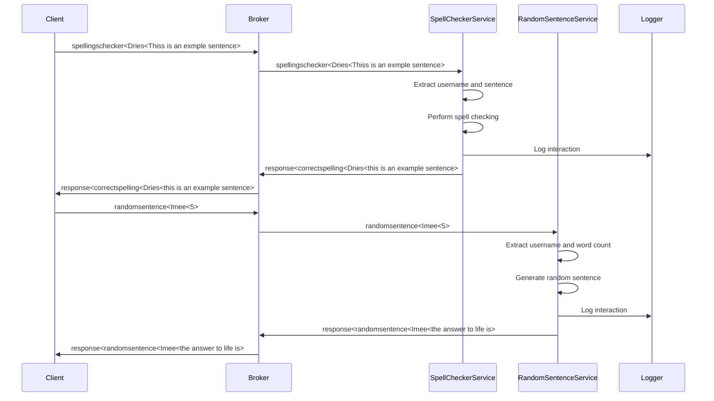
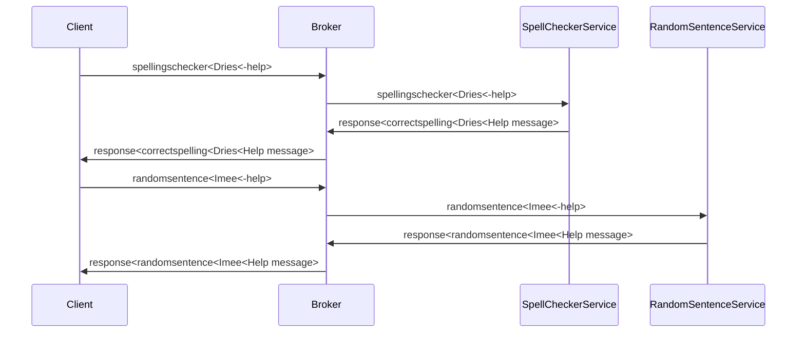

# Pxl_Benternet

## Overview
This project provides two services: a spelling correction service and a random sentence generation service, both utilizing ZeroMQ (ZMQ) for message passing. The architecture employs a client-server model where the servers (ZMQsub) subscribe to requests and send responses, while the client (ZMQpush) sends requests for services. 

## Contents of Repository
- dictionary.txt: A text file containing valid words used for spell-checking and random sentence generation.
- ZMQsub/: Folder containing the server components.
- ZMQClientUI/: Folder containing the client component.
- lib/: Folder containing ZeroMQ static libraries.
- include/: Folder containing ZeroMQ header files.
- service/: Folder containig a log from all the service traffic

## Requirements
- C++ compiler (e.g., g++, clang)
- The entire Benthernet repository from GitHub, which includes all necessary ZMQ components.

## Installation
1) Clone the Benthernet repository:
```
git clone https://github.com/driesnuttin25/Pxl_Benternet.git
```

2) The repository includes all necessary ZMQ components, so no additional installation is required.

## Architecture
The general ZMQ architecture is presented below by a sequence diagram.

Ofcourse this is not all that the program can do. There is for instance a way for the client to ask for help if something is note clear.




### Service (ZMQsub)
The ZMQsub Service includes two services: `SpellCheckerService` and `RandomSentenceService`. Both services listen for incoming requests over a ZMQ SUB socket and send responses over a ZMQ PUSH socket.

- **SpellCheckerService**:
  - Connects to the broker at `tcp://benternet.pxl-ea-ict.be:24042` to subscribe to spelling requests.
  - Listens for messages with the topic `spellingschecker<`.
  - Processes each word in the sentence, compares it to the `dictionary.txt` file, and constructs a corrected sentence.
  - Sends the corrected sentence back to the broker with the topic `response<correctspelling<`.
Let us for instance take this code and see exactly what happens behind the scenes. Here is the logic behind the handeling:
### Detailed SpellCheckerService Flowchart

```mermaid
flowchart TD
    A[Start Service] --> B[Connect to Broker and Subscribe to spellingschecker<]
    B --> C[Initialize Logger and Load Dictionary]
    C --> D[Wait for Incoming Message]
    
    D -->|Message Received| E[Extract Username and Sentence]
    E --> F{Is Message Valid?}
    
    F -->|No| G[Log Error]
    G --> H[Send Error Response]
    H --> D
    
    F -->|Yes| I[Check for Help Request]
    I -->|Yes| J[Generate Help Message]
    J --> K[Send Help Response]
    K --> D
    
    I -->|No| L[Perform Spell Checking]
    L --> M[Generate Corrected Sentence]
    M --> N[Log Interaction]
    N --> O[Send Corrected Sentence Response]
    O --> D
    
    D -->|No Message| D[Wait for Incoming Message]
 ```

- **RandomSentenceService**:
  - Connects to the broker at `tcp://benternet.pxl-ea-ict.be:24042` to subscribe to random sentence requests.
  - Listens for messages with the topic `randomsentence<`.
  - Generates a random sentence based on the specified word count using words from the `dictionary.txt` file.
  - Sends the generated sentence back to the broker with the topic `response<randomsentence<`.
 

### Client (ZMQpush)
The ZMQpush client allows users to send requests to the ZMQsub servers and receive responses. It connects to a ZMQ PUSH socket for sending requests and a ZMQ SUB socket for receiving responses.

- **Client**:
  - Connects to the broker at `tcp://benternet.pxl-ea-ict.be:24041` to push requests.
  - Connects to the broker at `tcp://benternet.pxl-ea-ict.be:24042` to subscribe to response messages.
  - Subscribes to `response<` messages.
  - The user inputs a request for either spelling correction or random sentence generation.
  - Sends the request to the server with the appropriate topic (`spellingschecker<` or `randomsentence<`).
  - Receives the response from the server and displays it to the user.
  - All of this is wrapped in a Qt GUI that is easy to understand.

## Usage Without ZMQpush
If users choose not to utilize the ZMQClientGUI, they can interact with the services as follows:

1) Establish a ZMQ PUSH socket in their own client implementation.
2) Connect to `tcp://benternet.pxl-ea-ict.be:24041` and send messages with the topic `spellingschecker<` or `randomsentence<` followed by the respective request.
3) Create a ZMQ SUB socket, subscribe to `response<correctspelling<` or `response<randomsentence<` topics, and listen for the server's response.

## Example Requests and Responses
### Spelling Correction Service
**Request**:

``` spellingschecker<Dries<Thiss is an exmple sentence> ```

**Response**:

```response<correctspelling<Dries<this is an example sentence>```

### Random Sentence Service
**Request**:

``` randomsentence<chickenlord<5> ```

**Response**:

``` response<randomsentence<chickenlord<fool genetics freely header resolving>```


## Troubleshooting
If you encounter any issues, ensure that:
- You are connected to the correct broker address and port.
- The topics are correctly specified for both requests and responses.
- `dictionary.txt` is in the correct location and readable by the server.

## Contribution
Contributions to the project are welcome. Please follow the standard GitHub pull request process to submit your contributions.

